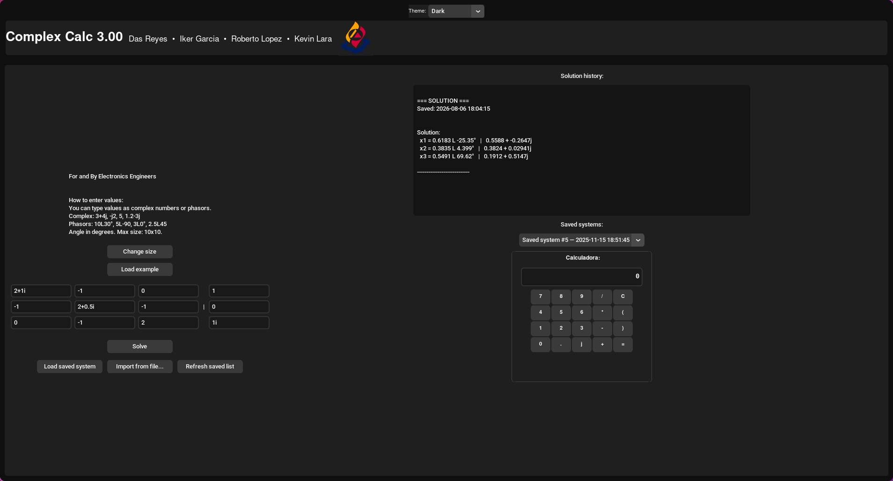
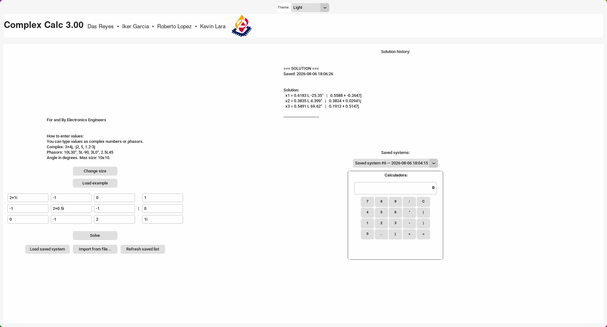

# Py-ComplexCalc

**A complete, user-friendly GUI ecosystem for solving n×n complex linear systems (Ax=b)**—built for electronics engineers, circuit analysts, and students working with AC circuits, impedance calculations, and complex number mathematics.

**Solve Ax=b instantly** with dual-format output (polar & rectangular), flexible input, and full system persistence.

| Dark theme | Light theme |
|---|---|
|  |  |

---

## ✨ Features

- **🔢 Dual Input Format**
  - Rectangular: `3+4j`, `-j2`, `5` (supports both `i` and `j` for imaginary unit)
  - Phasor: `10L30`, `5L-90°`, `3L0` (polar notation with degree angles)
  - Mix both formats in the same system
- **📊 Dual-Format Output**
  - Solutions shown in **polar** and **rectangular** simultaneously
- **🌓 Multiple Themes**
  - Dark, Light, Pink, Mint, Purple, Ocean — toggle anytime
- **💾 System Persistence**
  - Auto-save/load all computed systems
  - **File menu**: save current system, import from file, load saved system, refresh list
  - Export results (`.py`, `.txt`)
  - Session history with timestamps
- **🎯 Dynamic Matrix Sizing**
  - Solve 1×1 up to 10×10 systems
- **🧮 Built-in Calculator**
  - Quick complex-number scratchpad with backspace support
- **🚀 Standalone Executables**
  - Windows `.exe` and Linux binary — no Python install needed (see [Releases](https://github.com/IKGB105/Py-ComplexCalc/releases))

---

## ℹ️ About

| | |
|---|---|
| **Version** | 4.00 |
| **Last updated** | 2026-08-21 |
| **Repository** | [github.com/IKGB105/Py-ComplexCalc](https://github.com/IKGB105/Py-ComplexCalc) |
| **Institution** | Universidad Autónoma de Aguascalientes |
| **Department** | Ingeniería en Electrónica |

Also available inside the app itself: **Help → About Complex Calc...**

---

## 🚀 Quick Start

### Option 1: Standalone Executable

1. Download `UI_ComplexCalc.exe` (Windows) or `UI_ComplexCalc` (Linux) from the latest [Release](https://github.com/IKGB105/Py-ComplexCalc/releases).
2. Run it directly. No dependencies needed.

### Option 2: Run from Source

**Requirements:** Python 3.8+ (tested on 3.10, 3.11)

```bash
# Clone the repo
git clone https://github.com/IKGB105/Py-ComplexCalc.git
cd Py-ComplexCalc/code

# (Optional) Create virtual environment
python -m venv .venv
source .venv/bin/activate  # Linux/macOS
# or: .\.venv\Scripts\Activate  # Windows PowerShell

# Install dependencies
pip install -r requirements.txt

# Run the app
python UI_ComplexCalc.py
```

---

## 📝 Input Format Guide

| Format         | Examples         | Notes                                 |
|---------------|------------------|---------------------------------------|
| Rectangular   | `3+4j`, `-j2`, `5` | Supports `i` and `j` for imaginary unit |
| Phasor        | `10L30`, `5L-90°`, `3L0` | Polar notation, degree angles         |
| Mixed         | Any combination   | Rows/columns can mix formats          |

### Example: Solving a 3×3 Complex System

**Problem:** Solve Ax = b where:
```
A = [2+1i    -1      0   ]      b = [1  ]
    [-1    2+0.5i  -1  ]          [0  ]
    [0      -1      2   ]          [1i ]
```

**Steps:**
1. Launch the app
2. Select **3×3** from size dropdown
3. Enter matrix A and vector b values (any format)
4. Click **Solve**
5. View results in both forms

**Output:**
```
x₁ = 0.8 + 0.6j  (Rectangular)
   = 1.0 ∠ 36.87° (Polar)

x₂ = 0.4 + 0.2j
   = 0.447 ∠ 26.57°

x₃ = 0.2 - 0.4j
   = 0.447 ∠ -63.43°
```

---

## 🛠️ Building a Standalone Executable (Windows & Linux)

PyInstaller builds a native executable for whatever OS you run it on — it
does **not** cross-compile, so a Windows `.exe` must be built on Windows
and a Linux binary must be built on Linux. This repo's GitHub Actions
workflow (`.github/workflows/build.yml`) does both automatically — trigger
it manually from the **Actions** tab, or push a tag like `v4.1` to also
publish a Release.

To build locally:

```bash
pip install pyinstaller
cd code
pyinstaller UI_ComplexCalc.spec
# Output: code/dist/UI_ComplexCalc(.exe on Windows)
```

---

## 📂 Project Structure

```
Py-ComplexCalc/
├── code/
│   ├── UI_ComplexCalc.py      # Main GUI (customtkinter)
│   ├── ComplexCalc.py         # Core solver & parsing logic
│   ├── UI_ComplexCalc.spec    # PyInstaller build spec
│   ├── requirements.txt       # Python dependencies
│   ├── HK.jpg                 # UI background / window icon
│   ├── IE.png                 # Institution logo
│   └── themes.json            # Color theme definitions
├── tests/
│   └── test_complexcalc_core.py  # Parser/solver robustness tests
├── doc/                        # Manuals
├── images/                     # README screenshots
└── LICENSE
```

---

## 🧪 Tests

Robustness tests for the parser, solver and persistence core (malformed
input, singular matrices, out-of-range sizes) — no extra dependencies:

```bash
python3 -m unittest discover -s tests -v
```

---

## 📋 Dependencies

| Package         | Purpose                                 |
|-----------------|-----------------------------------------|
| `numpy`         | Linear algebra (Gaussian elimination)   |
| `customtkinter` | Modern, theme-aware GUI widgets         |
| `pillow`        | Image loading for UI assets             |

**Install all at once:**
```bash
pip install -r code/requirements.txt
```

---

## 🎨 Customization

- **Change Theme Colors:** Edit `code/themes.json`.
- **Custom Images:** Replace `HK.jpg` and `IE.png` with your own (same filenames).

---

## 🐛 Troubleshooting

| Problem                    | Solution                                                        |
|----------------------------|-----------------------------------------------------------------|
| GUI won't start            | Install/upgrade customtkinter: `pip install --upgrade customtkinter` |
| "Singular matrix" error    | Matrix A must be invertible. Check for duplicate/linearly dependent rows. |
| Parsing error              | Use `3+4j` (no spaces), `10L30` (not `10L30.5`).                |
| Images not loading         | Ensure `HK.jpg` and `IE.png` exist in the same folder as `UI_ComplexCalc.py`. |
| Executable blocked by antivirus | False positive (Windows). Add to antivirus whitelist or build from source. |

---

## 📞 Support & Contributions

- **Bug Reports:** [GitHub Issues](https://github.com/IKGB105/Py-ComplexCalc/issues)
- **Feature Requests:** [GitHub Discussions](https://github.com/IKGB105/Py-ComplexCalc/discussions)
- **Pull Requests:** Welcome! Fork, branch, and submit a PR.

### Roadmap
- [ ] CSV import/export for batch solving
- [ ] Phasor diagram real-time visualization
- [ ] Advanced matrix operations (eigenvalues, determinants)

---

## 👥 Credits

**Developers:**
- Iker Garcia — [ikergarcia450@gmail.com](mailto:ikergarcia450@gmail.com)
- Das Reyes — [das.reyxr@outlook.com](mailto:das.reyxr@outlook.com)

**Built With:**
- [NumPy](https://numpy.org/) — Numerical computing
- [CustomTkinter](https://github.com/TomSchimansky/CustomTkinter) — Modern UI toolkit
- [Pillow](https://python-pillow.org/) — Image processing
- [PyInstaller](https://pyinstaller.org/) — Executable packaging

---

## 📄 License

MIT License — See [LICENSE](./LICENSE) for details.

**TL;DR:** Use freely, attribute the authors, no warranty.

---

**For Electronics Engineers, By Electronics Engineers** ⚡

*"Solve complex systems instantly. Focus on the engineering that matters."*
